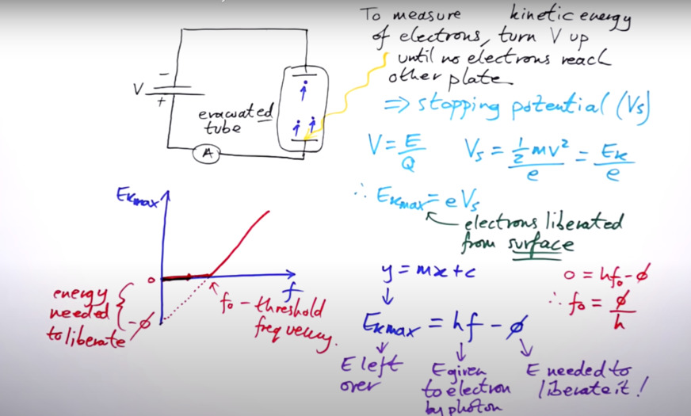

= Physics
:revnumber: 1.0
:version-label: Revision
:sectnums:
:toc:
:stem:
:hardbreaks-option:

== Revisions History
[%autowidth, cols="<,>,<"]
|===
|Date              | Rev   | Changes

|January 25, 2022  |  1.0  | Initial release
|===

include::copyright.adoc[]

== Background

this information is to review basic of physics:

- basic knowledge of physics theory
- mathematics equations

This information will be used to deduce the following end-user information:

- ASK and FSK packets with precise timestamp, possibly with bitrate and demodulation info
	* packets extracted from bits
	* bitrate calculated from precise timestamp
	* ASK amplitude extracted from amplitude samples
	* FSK deviation extracted from frequency samples

== test math format

stem:[sqrt(4) = 2]

stem:[H_2O]

latexmath:[C = \alpha + \beta Y^{\gamma} + \epsilon]

A matrix can be written as stem:[[[a,b\],[c,d\]\]((n),(k))].

[stem] 
++++ 
sqrt(4) = 2

E_[kmax] = h.f
++++

image::test1.jpg[]

== second test 

=== subtitle

_Note: this is note test._ 

.GeneralPacket
[%autowidth, cols="<,>"]
|===
| Field Name                                 | Count Bits

| Header                                     | 32
a| Payload

* Length defined by Header.PayloadByteLength | var

a| Padding

* Pad the whole packet to 32-bits alignment
* Set a constant value of 0xDA               | 0/8/16/24

a| Footer

* Duplicata of Header with all bits inverted | 32
|===

== Photoelectric

Kinetic energy is not depend on intensity of light but it’s depend on only frequency of light

|===
|stem:[E = h.f]

|===
- h: Planck constant = *6.62607015e−34 Js* (joule second)
- f: Frequency of light

stem:[V_s = frac{E_{kmax}}{e}]

- Vs: stopping potential (voltage)

_note: So energy could be in eV (electron volt)_

|===
|stem:[E_{kmax} = hf - \phi]

|===
stem:[\phi]: work function or energy needed to liberate an electron
stem:[f_o]: threshold frequency

[frame=none, grid=none, cols="15,~"]
|===
|then: |stem:[f_o = \frac{\phi}{h}]
|===

=== video
in this two videos we can see the basic theory of photoelectric effect and all the math plus some history behind

video::I_7ZfMlIKhk[youtube]

'''

video::iPpJQv1ScKk[youtube]

'''

== Electromagnetic
Coulomb's law:
there is force between each two charge stem:[F = K_e\frac{q_1q_2}{d^2}] (stem:[K_e] is coulomb's constant stem:[8.988\times10^9 Nm^2/C^2])
then any charge create a field that can effect any other charge in his space so we call this field as _Electric Field_.
Electric field over a sphere with a charge inside stem:[E = \frac{F}{q_t} = \frac{q}{4\pi\varepsilon_oR^2}  (N/C) (K_e = \frac{1}{4\pi\varepsilon_o})]

Electric flux:
stem:[\phi_E = \oint\overline{E}.\overline{dA}]

_where E (stem:[N/C] newton/colomb) is Electric field and A (stem:[m^2]) is orthogonal tiny surface so stem:[\phi_E] unit is stem:[{Nm^2}/C]_

Quass's law (over a closed surface):
stem:[\phi_E = \frac{q_{Total}}{4\pi\varepsilon_oR^2} * 4\piR^2 = \frac{q_{Total}}{\varepsilon_o}]

_where q is total charge inside the closed surface and The constant stem:[\varepsilon_o] is the https://en.wikipedia.org/wiki/Vacuum_permittivity/[*vacuum electric permittivity*]_

Ampere's law:
stem:[\oint\overline{B}.\overline{dl} = \muI]

Faraday's law:
changing magnetic flux => EMF (Electromotive Force)
stem:[\varepsilon_{EMF} = -\frac{d\phi_M}{dt}] where magnetic flux is stem:[\phi_M = \ointB.dA]
stem:[\varepsilon_{EMF} = \frac{W}{q} = \frac{\ointF.dl}{q} = \ointE.dl]

|===
|stem:[\oint\overline{E}.\overline{dl} = -\frac{d\phi_M}{dt}]
|===